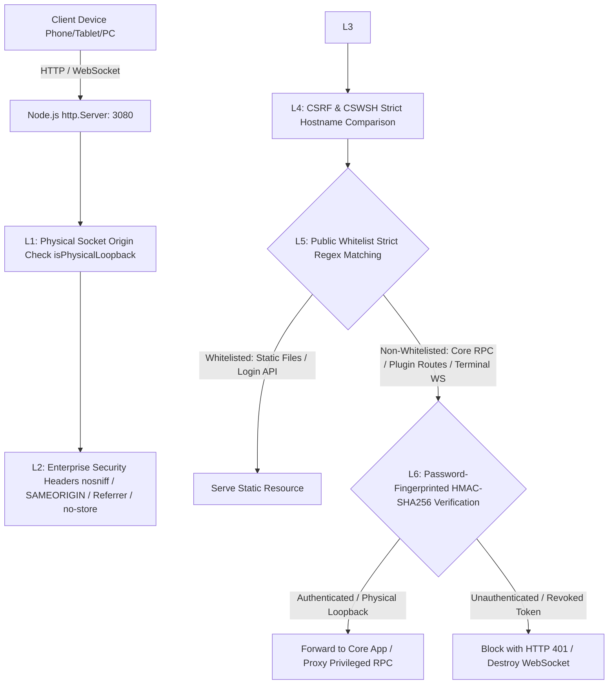

# dsh-plugin-auth-guard

<p align="center">
  
</p>

<h3 align="center">Enterprise-Grade Zero-Trust Authentication, LAN/Public Access Control & Security Gate Plugin for DeepSeek Harness (DSH)</h3>

<p align="center">
  <a href="LICENSE"></a>
  <a href="https://github.com/lijx122/dsh-plugin-auth-guard/releases"></a>
  <a href="https://github.com/deepseek-ai/deepseek-harness"></a>
  <a href="https://nodejs.org/">=20"></a>
  
</p>

<p align="center">
  English Documentation | <a href="README_CN.md">简体中文文档 (README_CN.md)</a>
</p>

---

## 📖 Background & Problem Statement

DeepSeek Harness (DSH) is a powerful AI coding agent runtime designed natively for local desktop workflows (`127.0.0.1`). When developers attempt to expose DSH across local area networks (LAN) to mobile devices (iOS/Android) or host it on remote cloud servers, they encounter critical barriers:

1. **Privileged Interface 403 Blocking**: DSH natively enforces hardcoded loopback fences. Any non-localhost request calling `settings.describe` or `llm.providers` is blocked with `403 Forbidden`, making remote model switching impossible.
2. **Mobile RPC Crashes**: Mobile browsers (iOS Safari / Chrome Android) lack Secure Context over plain HTTP, rendering `crypto.randomUUID` undefined and breaking all RPCs.
3. **Severe Remote Code Execution (RCE) Risks**: DSH lacks built-in authentication. Opening port 3080 to LAN or WAN allows anyone on the network to create sessions and execute arbitrary shell commands via the coding agent.
4. **Third-Party Plugin Escapes**: Sidebar plugins (`dsh-better-sidebar`) and package managers expose PTY terminal sockets (`/sidebar/ws/terminal`) and arbitrary file access without authentication.

**`dsh-plugin-auth-guard` is the zero-intrusion, production-ready solution.** It unblocks remote access, injects mobile polyfills dynamically, and establishes a **full-stack Default-Deny Zero-Trust Security Gateway** with cryptographic credential lifecycle management.

---

## 🏗️ Architecture Overview



---

## 🌟 Highlights & Technical Specifications

### 1. 🌐 Adaptive Network Exposure & Privileged RPC Bridge
- **0.0.0.0 Automatic Binding**: Binds Web GUI to `0.0.0.0:3080` and dynamically enumerates all active LAN IPv4 interfaces.
- **Privileged RPC Proxying**: Securely proxies `settings.describe`, `llm.providers`, `credentials.*` for authenticated clients, **completely eliminating 403 Forbidden errors**.
- **Dynamic Mobile Polyfill Injection**: Injects cryptographic UUID polyfills into `<head>` on the fly via `tapIndex`, ensuring smooth mobile operation over HTTP.

### 2. 🛡️ Default-Deny Zero-Trust Gateway
- **Socket-Level Interception**: Intercepts HTTP `request` and WebSocket `upgrade` events at the lowest TCP server level.
- **Strict Whitelist Verification**: Blocks unauthenticated access to all core RPCs (`/api/*`), plugin managers (`/api2/*`), and sidebar routes (`/sidebar/*`).

### 3. 🔑 Cryptographic Security & Credential Lifecycle
- **Salted Scrypt Password Hashing**: 32-byte Scrypt hash with random salt. Config fields declared with `.role('secret')` to prevent wire leakage.
- **Constant-Time Verification**: `crypto.timingSafeEqual` prevents timing side-channel attacks.
- **Password Fingerprint Binding**: HMAC-SHA256 tokens embed current password fingerprints. **Changing the password instantly revokes all tokens globally in milliseconds**.
- **Active WebSocket Purge**: Automatically terminates all active remote terminal/event WebSockets upon password change or logout.

### 4. 🚫 Anti-Spoofing & DoS Protection
- **Physical Socket Validation**: Validates `req.socket.remoteAddress` to prevent `Host: 127.0.0.1` spoofing and proxy loopback inversion.
- **IP Sliding Window Rate-Limiting**: Blocks IPs for 15 minutes after 5 consecutive failed attempts (`HTTP 429`) with auto-garbage collection (GC).
- **Global Burst Throttling**: Restricts total login frequency to 40 req/min across all IPs to defeat distributed botnets.
- **64KB Request Body Cutoff**: Aborts payloads exceeding 64KB to prevent stream-based OOM denial-of-service attacks.
- **CSRF & CSWSH Protection**: Strict hostname matching blocks Cross-Origin Request Forgery and Cross-Site WebSocket Hijacking.

### 5. 🎨 Native DSH UI Design & Multi-Tab Synchronization
- **DeepSeek Design System**: Follows DSH CSS tokens (`--dsw-*`), fish logo, and standard typography.
- **Top-Level Body Portal Lock**: Mounts lock screen at `document.body` level (`z-index: 2147483647`) with background blur to prevent click-through.
- **Multi-Tab Sync**: Leverages `BroadcastChannel` for instant cross-tab state updates.

---

## 📦 Installation & Setup

### Option 1: Via DSH CLI (Recommended)
```bash
dsh plugin --profile web add github:lijx122/dsh-plugin-auth-guard
```

### Option 2: Via DSH Web Marketplace
1. In DSH Web GUI, go to **Settings** $
ightarrow$ **Plugins** $
ightarrow$ **Marketplace**.
2. Search for **`auth-guard`** and click **Install**.

### Option 3: Local Linking (Developer Mode)
1. Clone this repository to `~/.dsh/plugins/dsh-plugin-auth-guard`.
2. In `~/.dsh/profiles/web/package.json`, add:
   ```json
   {
     "dependencies": {
       "dsh-plugin-auth-guard": "link:../../plugins/dsh-plugin-auth-guard"
     }
   }
   ```
3. Append `"dsh-plugin-auth-guard"` to `dsh.profile.bundles` and restart DSH.

---

## ⚙️ Configuration Guide

Navigate to **Settings** $
ightarrow$ **Security & Access (安全与访问)**:

| Setting | Description | Default |
| :--- | :--- | :---: |
| **Require password for LAN/Remote access** | Requires password authentication when accessed from non-localhost IPs | **Enabled** |
| **Enforce authentication globally** | Enforces password authentication even on `127.0.0.1` localhost | Optional |
| **Administrator Credentials** | Set or change admin username and password ($\ge 6$ characters) | Customizable |
| **Active LAN IP Directory** | Real-time overview of all listening LAN addresses with 1-click copy | Auto-detected |

---

## 🚀 Production Reverse Proxy Best Practice (Nginx)

For public cloud deployments, hosting DSH behind an **Nginx HTTPS reverse proxy** is recommended:

```nginx
server {
    listen 80;
    server_name ai.yourdomain.com;
    return 301 https://$host$request_uri;
}

server {
    listen 443 ssl http2;
    server_name ai.yourdomain.com;

    ssl_certificate     /etc/nginx/ssl/ai.yourdomain.com.crt;
    ssl_certificate_key /etc/nginx/ssl/ai.yourdomain.com.key;
    ssl_protocols       TLSv1.2 TLSv1.3;
    ssl_ciphers         HIGH:!aNULL:!MD5;

    client_max_body_size 160M;

    location / {
        proxy_pass http://127.0.0.1:3080;
        proxy_http_version 1.1;

        # WebSocket Upgrade Headers (Mandatory)
        proxy_set_header Upgrade $http_upgrade;
        proxy_set_header Connection "upgrade";

        # Proxy Origin Headers
        proxy_set_header Host $host;
        proxy_set_header X-Real-IP $remote_addr;
        proxy_set_header X-Forwarded-For $proxy_add_x_forwarded_for;
        proxy_set_header X-Forwarded-Proto https;

        proxy_read_timeout 3600s;
        proxy_send_timeout 3600s;
    }
}
```

---

## ❓ FAQ & Troubleshooting

#### Q1: What should I do if I forget the administrator password?
1. Open `~/.dsh/settings.yaml` on the host machine.
2. Under `auth-guard:`, clear `passwordHash` and `salt` (set to `""`).
3. Restart DSH and open `http://127.0.0.1:3080` locally to initialize a new password.

#### Q2: Why are other devices logged out when the password is changed?
This is by design. Changing the password updates the password fingerprint in tokens and triggers the active WebSocket purge to ensure compromised credentials cannot be reused.

#### Q3: Why does mobile Safari work over plain HTTP without HTTPS certificates?
The plugin injects a `crypto.randomUUID` polyfill dynamically on the fly during HTML serving, allowing seamless mobile operation without local SSL setup.

---

## 📄 License

Distributed under the [MIT License](LICENSE).
