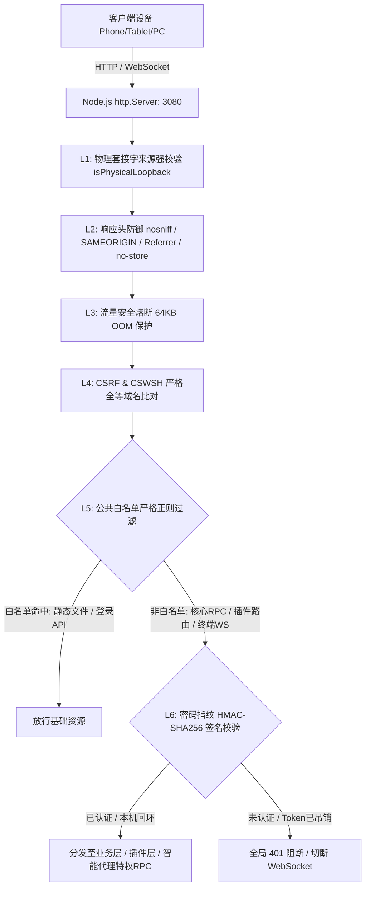

# dsh-plugin-auth-guard

<p align="center">
  
</p>

<h3 align="center">DeepSeek Harness (DSH) 原生企业级零信任安全访问控制与账号密码防护插件</h3>

<p align="center">
  <a href="LICENSE"></a>
  <a href="https://github.com/lijx122/dsh-plugin-auth-guard/releases"></a>
  <a href="https://github.com/deepseek-ai/deepseek-harness"></a>
  <a href="https://nodejs.org/">=20"></a>
  
</p>

<p align="center">
  <a href="README.md">English Documentation</a> | 简体中文文档
</p>

---

## 📖 痛点与背景（为什么需要此插件？）

DeepSeek Harness (DSH) 是一款出色的本地 AI Coding Agent 框架。由于原生定位主要面向单机桌面开发（`127.0.0.1` 本机环境），当开发者尝试在**局域网多设备（如手机/平板/办公室电脑）或云服务器公网部署**时，会面临三大核心痛点与重大安全隐患：

1. **特权接口 403 拦截**：DSH 核心源码中硬编码了回环安全栅栏，只要非 `127.0.0.1` 访问，模型配置读取（`settings.describe`）和提供商列表（`llm.providers`）一律被服务端强制返回 `403 Forbidden`，导致跨设备无法切换或配置模型。
2. **移动端非 HTTPS 运行崩溃**：iOS Safari 和 Android 移动端浏览器在非 HTTPS 局域网环境下，因缺少安全上下文（Secure Context）导致 `crypto.randomUUID` 为空，前端 RPC 通信全线瘫痪。
3. **远程暴露等同于全网开放 RCE（远程代码执行）**：原生 DSH 缺乏身份鉴权机制。只要将端口开放到局域网或公网，任何扫描到端口的访客均可直接调用 `session.create` / `session.append` 让 Agent 在你的主机上执行任意 Shell / PowerShell 命令。
4. **第三方生态插件特权逃逸**：侧边栏插件（如 `dsh-better-sidebar`）直接暴露了 `/sidebar/ws/terminal` 交互式 PTY 终端与文件读写接口，外部人员可直接直连终端接管机器。

**`dsh-plugin-auth-guard` 正是为此而生**：它在**零侵入 DSH 核心源码**的前提下，一键解除网络访问限制、动态注水移动端 Polyfill，并构建起一套**全站 Default-Deny 零信任安全网关与密码凭据全生命周期管理系统**。

---

## 🏗️ 架构设计与防护机理



---

## 🌟 核心特性与技术指标

### 1. 🌐 局域网自适应与特权智能放行
- **0.0.0.0 自动绑定**：通过 Cordis 补丁层无缝将 Web GUI 绑定至 `0.0.0.0:3080`，自动探测并列出本机所有活跃 IPv4 网卡地址。
- **特权接口安全代理**：通过精确路由机制为已认证客户端智能代理 `settings.describe`、`llm.providers`、`credentials.*` 等特权接口，**告别跨设备 403 错误**。
- **移动端 Polyfill 动态注水**：通过 `ctx.webServer.tapIndex` 动态向 HTML `<head>` 注入加密级 UUID 生成器，手机 Safari / Android 零报错秒开。

### 2. 🛡️ 全局零信任前置网关（Default-Deny Gateway）
- **全链路封锁**：在 Node.js `http.Server` 最底层接管所有 `request` 和 `upgrade` 事件。
- **白名单严格准入**：除静态资源（严格限定 `.js`、`.css`、`.svg`、`.woff2` 等合法后缀）及登录端点外，全站所有核心接口及第三方插件接口（如 `/api2/*` 插件管理器、`/sidebar/*` 侧边栏文件与终端）未认证一律物理掐断。

### 3. 🔑 企业级密码学与 Token 全生命周期
- **加盐 Scrypt 安全存储**：密码采用加盐 Scrypt（32字节）算法单向哈希，配置在 `settings.yaml` 中标记为 `role: secret`，**API 响应零机密泄露**。
- **时序攻击防御**：密码比对与 Token 验签均采用 `crypto.timingSafeEqual`，完全免疫时序侧信道攻击。
- **密码指纹绑定与即刻吊销**：HMAC-SHA256 Token 载荷深度绑定当前密码指纹，**管理员一旦修改密码，全网所有已登录设备的历史 Token 毫秒级即刻作废**。
- **存量长连接强制熔断**：管理员改密或注销时，服务端主动销毁所有现存的远程 WebSocket 套接字（`/sidebar/ws/terminal`），防止终端逃逸。

### 4. 🚫 网络防伪、防爆破与 DoS 熔断
- **防 Host / 代理冒充**：物理 TCP Socket `remoteAddress` 强校验，严禁通过伪造 `Host: 127.0.0.1` 越权；在反代环境下自动识别代理头，防止公网访客冒充回环。
- **IP 滑动窗口防爆破**：单 IP 连续输错 5 次密码自动锁定该 IP 15 分钟（`HTTP 429`），并具备 5000 记录自动垃圾回收（GC）。
- **全站并发熔断**：全站每分钟最多处理 40 次登录尝试，防止分布式代理池并发撞库。
- **64KB 流量熔断**：请求体限制在 64KB 内，超大垃圾流量立即断开连接，防御 OOM 内存耗尽攻击。
- **防 CSRF & CSWSH**：严格全等比对 Hostname，防御跨站请求伪造与跨站 WebSocket 劫持。

### 5. 🎨 原生 DSH UI 美术风格与多端联动
- **品牌美术深度融合**：全面适配 DSH 官方 CSS 变量（`--dsw-*`）、官方鲸鱼 Logo 及圆角设计。
- **Top-Level Body Portal 锁屏**：锁屏层直接挂载到 `document.body` 顶层（`z-index: 2147483647`），并注入全屏高斯模糊，**彻底阻断背景侧边栏穿透点击**。
- **跨标签页广播同步**：借助 `BroadcastChannel`，任意标签页发生登录、退出或改密时，其他打开的窗口毫秒级同步联动。

---

## 📦 安装与启用

### 方式 1：通过 DSH CLI 安装（推荐）
在终端中执行：
```bash
dsh plugin --profile web add github:lijx122/dsh-plugin-auth-guard
```

### 方式 2：在 DSH Web 插件市场安装
1. 打开 DSH Web 界面 $
ightarrow$ 点击左下角 **“设置 (Settings)”** $
ightarrow$ **“插件 (Plugins)”** $
ightarrow$ **“插件市场 (Marketplace)”**。
2. 搜索 **`auth-guard`** 或 **`安全`**，点击 **“安装”**。

### 方式 3：本地开发调试（源码软链接）
1. 克隆本项目至 `~/.dsh/plugins/dsh-plugin-auth-guard`。
2. 在 `~/.dsh/profiles/web/package.json` 中配置：
   ```json
   {
     "dependencies": {
       "dsh-plugin-auth-guard": "link:../../plugins/dsh-plugin-auth-guard"
     }
   }
   ```
3. 在 `dsh.profile.bundles` 中追加 `"dsh-plugin-auth-guard"`，重启 DSH 即可。

---

## ⚙️ 配置说明

浏览器打开 DSH，点击左下角 **“设置 (Settings)”** $
ightarrow$ **“安全与访问”** 专属卡片：

| 配置项 | 说明 | 默认推荐值 |
| :--- | :--- | :---: |
| **局域网/公网访问必须密码验证** | 开启后，非服务器本机设备访问时强制弹出全屏锁屏门禁，验证通过后方可使用 | **开启** |
| **全局强制密码认证 (包含本机)** | 开启后，即使在服务器本机 `127.0.0.1` 访问同样需要密码登录 | 可选 |
| **管理员账号与密码** | 支持随时修改用户名与新密码（长度需 $\ge 6$ 位，敏感变更需校验原密码） | 自定义 |
| **局域网地址速查** | 自动枚举当前设备的所有局域网 IP 与端口，支持点击一键复制 | 自动展示 |

---

## 🚀 生产环境反向代理最佳实践 (Nginx 配置范例)

若计划在云服务器上通过公网域名提供服务，建议在前端配置 **Nginx 开启 HTTPS 反向代理**：

```nginx
# Nginx 生产环境 HTTPS 反向代理配置范例
server {
    listen 80;
    server_name ai.yourdomain.com;
    return 301 https://$host$request_uri;
}

server {
    listen 443 ssl http2;
    server_name ai.yourdomain.com;

    # SSL 证书配置
    ssl_certificate     /etc/nginx/ssl/ai.yourdomain.com.crt;
    ssl_certificate_key /etc/nginx/ssl/ai.yourdomain.com.key;
    ssl_protocols       TLSv1.2 TLSv1.3;
    ssl_ciphers         HIGH:!aNULL:!MD5;

    # 请求体限制（与 DSH 大附件上传对齐）
    client_max_body_size 160M;

    location / {
        proxy_pass http://127.0.0.1:3080;
        proxy_http_version 1.1;

        # 必须传递 WebSocket 协议升级头
        proxy_set_header Upgrade $http_upgrade;
        proxy_set_header Connection "upgrade";

        # 传递真实客户端信息（本插件已适配防反代伪造解析）
        proxy_set_header Host $host;
        proxy_set_header X-Real-IP $remote_addr;
        proxy_set_header X-Forwarded-For $proxy_add_x_forwarded_for;
        proxy_set_header X-Forwarded-Proto https;

        # 保持长连接超时时间（适配 AI 长时间推理输出）
        proxy_read_timeout 3600s;
        proxy_send_timeout 3600s;
    }
}
```

---

## ❓ 常见问题与排查 (FAQ)

#### Q1: 忘记了管理员密码，如何重置？
由于密码哈希保存在本地配置文件中，直接在服务器物理主机上编辑配置文件即可重置：
1. 打开 `~/.dsh/settings.yaml`。
2. 找到 `auth-guard:` 分节，将 `passwordHash` 与 `salt` 清空（设为 `""`）。
3. 重启 DSH 后，在物理本机（`127.0.0.1:3080`）重新打开网页即可初始化新密码。

#### Q2: 为什么修改密码后，其他已登录的手机或电脑自动退出了？
这是本插件的 **Token 密码指纹绑定与主动 WebSocket 熔断机制**。管理员修改密码后，全网所有旧令牌会立即失效，存量长连接终端会被服务器主动切断，以确保密码泄露时能一键阻断所有潜在攻击者。

#### Q3: 为什么局域网普通 HTTP 访问也能在手机 Safari / Chrome 上正常工作？
插件内置了 `tapIndex` 动态注水引擎，在 HTML 渲染阶段自动下发 `crypto.randomUUID` Polyfill，无需在局域网自建复杂的 CA 证书即可畅享移动端 Web 访问。

---

## 📄 开源协议

本项目采用 [MIT License](LICENSE) 开源协议。
